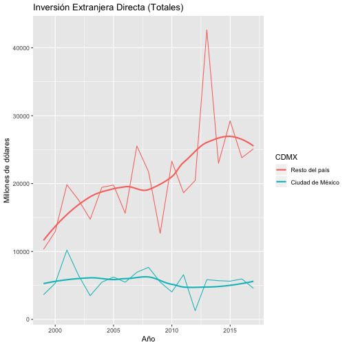
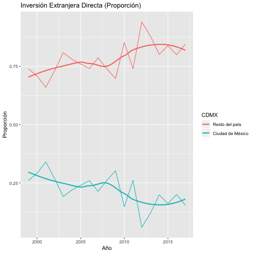

# Inversión extranjera directa en México 1999-2017

By: [Patricio R. Estévez Soto](https://twitter.com/prestevez)

Revisión de la inversión extranjera directa (IED) hacia México según datos de la [Secretaría de Economía](https://datos.gob.mx/busca/dataset/inversion-extranjera-directa/resource/caca107b-ad92-4e2e-b862-3d9b3e4050eb). 

Visualización gráfica de las tendencias de inversión extranjera directa.

Proporción de IED dirigido a la CDMX entre 2001 y 2004.

|                 |      IED|         %|
|:----------------|--------:|---------:|
|Resto del país   | 71597.12| 0.7363028|
|Ciudad de México | 25641.57| 0.2636972|

El total de IED dirigido al país fue de 97,239 millones de dólares. La CDMX atrajo 25,642 millones de dólares. Por tanto, atrajo solo el 26% de la IED nacional.

Histórico de atracción de IED y proporción de la CDMX.

|  Año| IED: CDMX| IED: Nacional| % CDMX|
|----:|---------:|-------------:|------:|
| 1999|   3627.02|      13943.60|  26.01|
| 2000|   5318.29|      18247.11|  29.15|
| 2001|  10210.36|      30041.84|  33.99|
| 2002|   6471.10|      24055.32|  26.90|
| 2003|   3485.41|      18225.13|  19.12|
| 2004|   5474.70|      24916.40|  21.97|
| 2005|   6239.06|      26023.12|  23.98|
| 2006|   5472.42|      21098.11|  25.94|
| 2007|   6930.78|      32468.26|  21.35|
| 2008|   7668.73|      29420.00|  26.07|
| 2009|   5488.07|      18165.25|  30.21|
| 2010|   4030.03|      27319.02|  14.75|
| 2011|   6574.84|      25221.35|  26.07|
| 2012|   1278.34|      21730.32|   5.88|
| 2013|   5846.98|      48491.72|  12.06|
| 2014|   5691.36|      28672.01|  19.85|
| 2015|   5621.96|      34857.63|  16.13|
| 2016|   5952.81|      29755.07|  20.01|
| 2017|   4573.70|      29695.01|  15.40|
